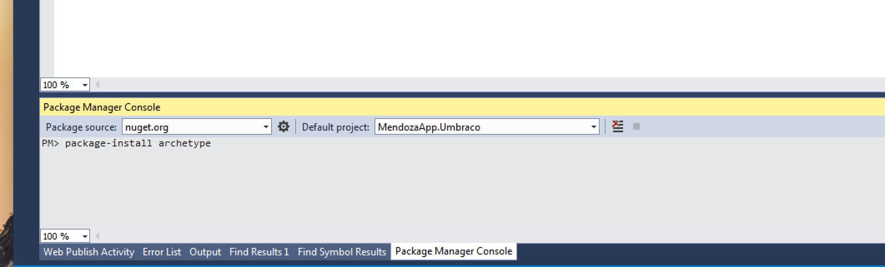
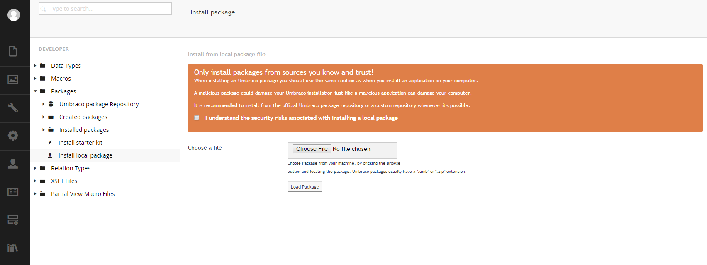

#Installation#

Installation is a breeze, the preferred way to install Archetype is via Nuget (https://www.nuget.org/packages/Archetype/).

Type: `install-package archetype` in your Visual Studio NuGet Package Manager.

The other way is to use the normal Umbraco Package install method with the download found here: https://our.umbraco.org/projects/backoffice-extensions/archetype

