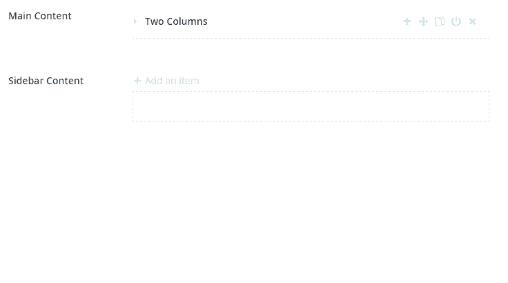

# Configuration

Configuration can seem daunting, but to create your first Archetype, do the the following:

* Navigate to `Developer->Data Type`
* Right click and create a new data type.
* Select `Archetype` from the dropdown.
* Name your fieldset
* Give your fieldset an alias (or accept the default)
* Add one or more properties
* Each property needs a name, an alias and a data type

That is all that is required.


Tick the `Toggle Advanced Options` box to expose advanced options.

## Add to a Document Type
Once configured, navigate to `Settings->Document Types` and add the new data type to a document type.

## Multiple Fieldsets

You can enable multiple fieldsets in a single Archetype by going into the advanced options and ticking `Enable Multiple Fieldsets?`.

This will expose a hidden plus sign that allows that you'll need to click to add another fieldset type.  It also allows you to choose an installed icon to separate the two types visually once added to a document type.

## Nested Archetypes

You can nest Archetypes within Archetypes; they can even reference themselves (supposing you also start with the add button to avoid infinite nesting).

## Cross-Archetype Dragging

To allow for Archetype fieldsets to be dragged between Umbraco properties and into/out of nested Archetypes, check the "Enabled Cross-Archetype Dragging" configuration option.

Once enabled, you will be able to drag compatible Archetype fieldsets to other Archetypes, whether they are entirely different properties or they are nested Archetypes:



## Label Template

You can configure Archetype to show a value from inside your Archetype to be shown on the collapsed fieldset title.

Typically you would use this syntax in the `Label Template` box: `{{propertyName}}`.

You can pass in a custom function into the label with the following syntax `{{myFunction(propertyName)}}`.

You can pass args to your label template too, please keep reading thru the examples if interested.

Make sure your function is available to Umbraco by adding your custom code to a package manifest.

### Promises and Dependency Injection in Label Templates

Starting with Archetype 1.16.0, you can create label template functions that return promises and that support injection of AngularJS dependencies. This comes in handy for more advanced scenarios, such as when you need to perform asynchronous operations like getting data from the web server.

In most instances where you would use a promise, you will also want to inject an AngularJS dependency that has a function that returns a promise. So, you'll first want to know how to have dependencies injected. You can do so like this:

```js
function archetypeGetNodeUrl(value) {
    return function (contentResource) {
        /* Your code here. */
    };
}
```

That will allow you to inject the `contentResource` service. All you need to do in order to have a dependency injected is return a function with that dependency as one of the parameters.

Taking this example further, you could then return a promise from the function:

```js
function archetypeGetNodeUrl(value) {
    return function (contentResource) {
        if (!value) {
            return "Unknown URL";
        }
        return contentResource.getById(value)
            .then(function (response) {
                return response.urls[0] || "Unknown URL";
            });
    };
}
```

You will likely want to add some caching so subsequent requests to your function don't initiate server-side calls every time it is called. Here's an example of how you might go about that:

```js
function archetypeGetNodeUrl(value) {
    return function (contentResource) {
        if (!value) {
            return "Unknown URL";
        }
        archetypeGetNodeUrl.cache = archetypeGetNodeUrl.cache || {};
        if (archetypeGetNodeUrl.cache[value]) {
            return archetypeGetNodeUrl.cache[value];
        }
        return contentResource.getById(value)
            .then(function (response) {
                archetypeGetNodeUrl.cache[value] = response.urls[0] || "Unknown URL";
                return archetypeGetNodeUrl.cache[value];
            });
    };
}
```

The above code can also be rewritten like so and it would function the same way, though perhaps slightly faster:

```js
function archetypeGetNodeUrl(value) {
    if (!value) {
        return "Unknown URL";
    }
    archetypeGetNodeUrl.cache = archetypeGetNodeUrl.cache || {};
    if (archetypeGetNodeUrl.cache[value]) {
        return archetypeGetNodeUrl.cache[value];
    }
    return function (contentResource) {
        return contentResource.getById(value)
            .then(function (response) {
                archetypeGetNodeUrl.cache[value] = response.urls[0] || "Unknown URL";
                return archetypeGetNodeUrl.cache[value];
            });
    };
}
```

This demonstrates that you can return different types of objects from your function at different times. In the case of a cache hit, this will return a string. In the case of a cache miss, this will return a function that will return a promise that will resolve to a string.

Here is a heavily commented version of the above function, which should help you to understand what each line is doing:

```js
/**
 * This function will be called from an Archetype label template, and it will eventually
 * resolve to a string that is the URL of the supplied content node ID.
 * @param value The content node ID.
 * @returns {*} A string or a function. In the case of a function, it will be called and
 *      will subsequently return a promise. That promise will then eventually resolve to
 *      a string value.
 */
function archetypeGetNodeUrl(value) {
    
    // If the supplied value is falsy (e.g., null or undefined), return early.
    if (!value) {
        return "Unknown URL";
    }
    
    // Ensure the cache has been initialized.
    archetypeGetNodeUrl.cache = archetypeGetNodeUrl.cache || {};
    
    // If the node is already in the cache, return the URL from the cache.
    if (archetypeGetNodeUrl.cache[value]) {
        return archetypeGetNodeUrl.cache[value];
    }
    
    // Return a function that will be called and have its dependencies injected.
    return function (contentResource) {
        
        // Call Umbraco's contentResource service. Specifically, the getById function,
        // which will return information about a content node by its ID. This will return
        // a JavaScript promise.
        return contentResource.getById(value)
            // Now that getById has returned a promise, we will process the result of that
            // promise and return yet another promise that will eventually resolve to a
            // string.
            .then(function (response) {
                
                // Store the URL to the cache, then return it.
                archetypeGetNodeUrl.cache[value] = response.urls[0] || "Unknown URL";
                return archetypeGetNodeUrl.cache[value];
                
            });
    };
    
}
```

### Addtional Samples
```js
//create a namespace (optional)
var ArchetypeSampleLabelHelpers = {};

//create a function
//you will add it to your label template field as `{{ArchetypeSampleLabelHelpers.testPromise(someArchetypePropertyAlias)}}`
ArchetypeSampleLabelHelpers.testPromise = function(value) {   
    //you can inject services
    return function ($timeout, archetypeCacheService) {        
        //best to return a promise
        //NOTE: $timeout returns a promise
        return $timeout(function () {
            return "As Promised: " + value;
        }, 1000);
    }
}

ArchetypeSampleLabelHelpers.testEntityPromise = function(value, scope, args) {
    //hey look, args!
    //{{ArchetypeSampleLabelHelpers.testEntityPromise(someArchetypePropertyAlias, {foo: 1})}}
    console.log(args);
    
    return function ($q, entityResource) {    
        var deferred = $q.defer();
    
        entityResource.getById(args.foo, 'document').then(function(entity) {
            console.log("Hello from testEntityPromise");
            console.log(entity);
            deferred.resolve(entity.name);
        });
    
        return deferred.promise;
    }
}

ArchetypeSampleLabelHelpers.testEntityPromise2 = function(value, scope, args) {  
    //hey look, args but we're also using the built-in archetypeCacheService
    //{{ArchetypeSampleLabelHelpers.testEntityPromise(someArchetypePropertyAlias, {foo: 1234})}}
    console.log(args);        
    
    return function ($q, archetypeCacheService) {    
        var deferred = $q.defer();
    
        archetypeCacheService.getEntityById(args.foo, 'document').then(function(entity) {
            console.log("Hello from testEntityPromise2");
            console.log(entity);
            deferred.resolve(entity.name);
        });
    
        return deferred.promise;
    }
}
```

## Change the Style of Archetype in the Backoffice
Archetype allows you to do the following to customize the backoffice experience for your editors:

* Modify the view globally
* Modify the view per Archetype data type instance
* Modify the CSS globally
* Modify the CSS per Archetype data type instance
* Add a JS script globally
* Add a class name to an Archetype

### Global Changes
To make global changes, simply edit any of these files:

* Any file located in: `~/App_Plugins/Archetype/views/`
* `~/App_Plugins/Archetype/css/archetype.css`

>Modifying these files will alter the look and feel of Archetype globally, however this is the same as modifying the core of Archetype and you'll have to make these changes after each upgrade to the next version of Archetype.

### Per Data Type Instance
Archetype will allow you to also change the look and feel on a per data type basis as defined below:

* You can completely swap out the default view with another one. Navigate to `Developer>Data Types` and select your Archetype. Update the configuration property `View File` with a path to your new view file. v7.3+ users will find this under the `Custom Style/Script Options`. It's easiest to start with a copy of the `~/App_Plugins/Archetype/Views/archetype.default.html` file, make your changes and save it as a new view. Just remember to point your Archetype to the new view.
* Next you can add CSS and JS conditionally to a page. Since Umbraco is a pretty much a single page app, you can inject a CSS and/or a JS file by simply specifying a path to a CSS or JS file in the Archetype configuration. Again v7.3+ users will find this under the `Custom Style/Script Options`.
* Lastly, you can also quickly add a class to an Archetype for styling or JS purposes by specifying the `Custom Wrapper Class` field in the configuration. This can be used in conjunction with either the JS or CSS file options.

>Note that these changes are resistant to upgrades of Archetype and will be kept without any worries unlike the global changes in the previous section.
