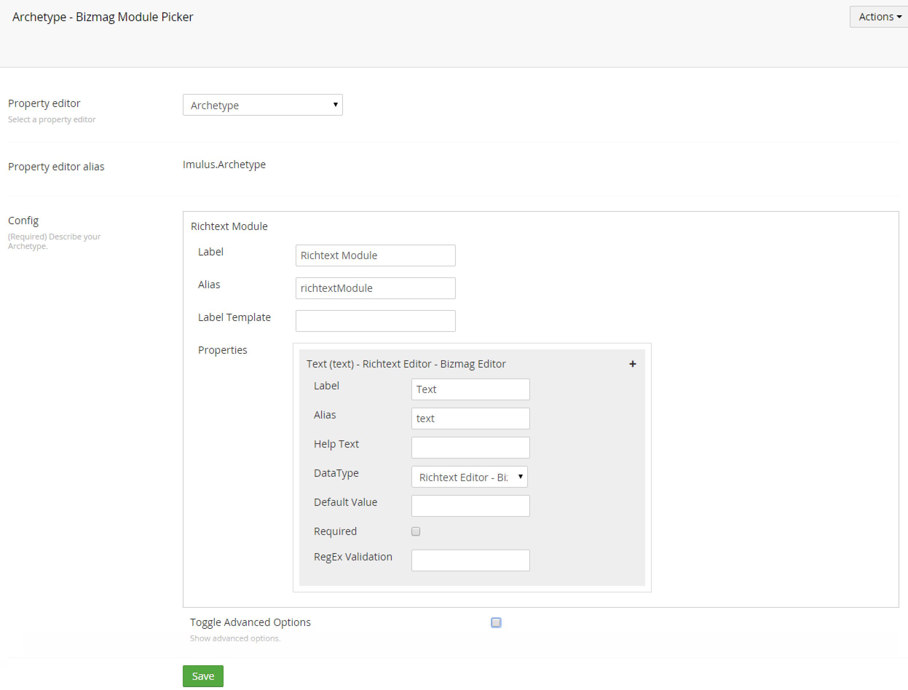
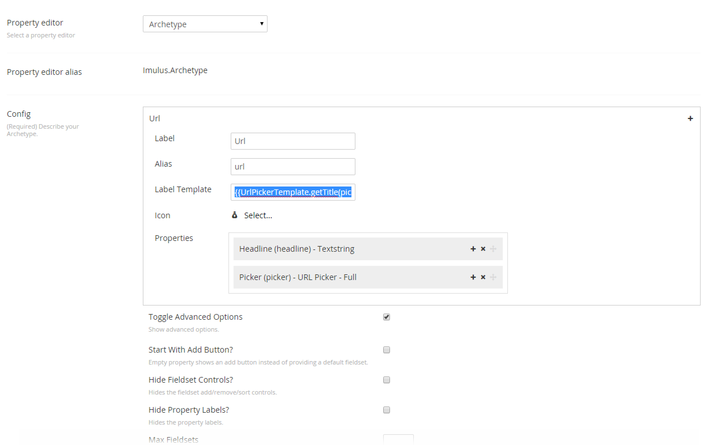

#Configuration#

Configuration can seem daunting, but to create your first Archetype, do the the following:

* Navigate to `Developer->Data Type`
* Right click and create a new data type.
* Select `Archetype` from the dropdown.
* Name your fieldset
* Give your fieldset an alias (or accept the default)
* Add one or more properties
* Each property needs a name, an alias and a data type

That is all that is required.



Tick the `Toggle Advanced Options` box to expose advanced options.

##Add to a Document Type##
Once configured, navigate to `Settings->Document Types` and add the new data type to a document type.

##Multiple Fieldsets##

You can enable multiple fieldsets in a single Archetype by going into the advanced options and ticking `Enable Multiple Fieldsets?`.

This will expose a hidden plus sign that allows that you'll need to click to add another fieldset type.  It also allows you to choose an installed icon to separate the two types visually once added to a document type.

##Nested Archetypes##

You can even nest Archetypes within Archetypes provided they are not referencing themselves.

##Label Template##

You can configure Archetype to show a value from inside your Archetype to be shown on the collapsed fieldset title.

Typically you would use this syntax in the `Label Template` box: `{{propertyName}}`.

Using the above syntax will get the value of the property and use it as the label.  However some data types have a complex model value and therefore it doesn't make sense to do so.  The following example shows how to grab the title field from the [UrlPicker](https://www.nuget.org/packages/UrlPicker/) data type and use it as the label:

First we will need to add some code to our project by registering it with a `package.manifest` file at `~/App_Plugins/ArchetypeLabelTemplates/package.manifest`:

```
{
  "javascript": [
    "~/App_Plugins/ArchetypeLabelTemplates/urlpicker.js"
  ]
}
```

Then create your `urlpicker.js` file at the above location and define a function:

```
var UrlPickerTemplate = {};
 
UrlPickerTemplate.getTitle = function (value, scope) { 
    //this is the property model
    if (value) {
        return value.meta.title;
    }
    
    //if you wanted to get the name of the content instead, you'd have to get it from the server here since it's not in the model
 
    return "";
};
```

Finally, call your new function from inside the Archetype config (`{{UrlPickerTemplate.getTitle(picker)}}`).  Please note you pass the property alias to your function.  Your function then takes two arguments (value and scope).

