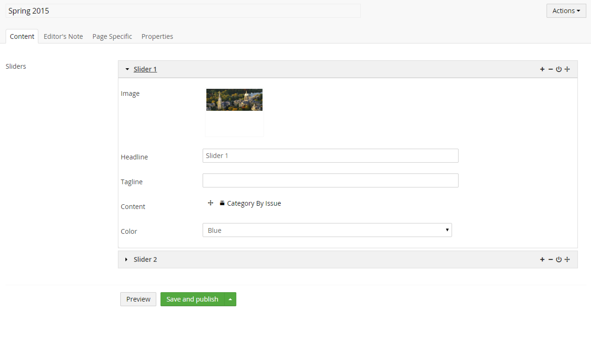

#Archetype#

Archetype is an Umbraco 7 property editor that wraps other installed property editors. By wrapping the other properties, Archetype allows for custom and repeatable fieldset mashups.

##Features at a Glance##
Archetype can do many things but most people will only need a few features provided below:

###Basic###
* Create groupings (fieldsets) of installed data types
* Enable/disable fieldsets or delete them
* Sortable fieldsets
* Validation
* Allow for zero or more fieldsets
* Enforce a maximum number of fieldsets
* Hide property labels for more screen space
* Toggle collapsing behavior
* Clone fieldsets

###Advanced###
* Multiple types of fieldsets mixed together
* Add custom CSS
* Add custom JS
* Switch the view altogether
* Enable route hijacking by your server side code 
* Disable the built-in property value converter so you can implement your own

##Use Cases##
The best use case for Archetype occurs when you need a short list of collapsible fieldsets that contain other installed data types.  The best concrete example would be using hero sliders:

##Source##
The source is open and located at: https://github.com/imulus/Archetype